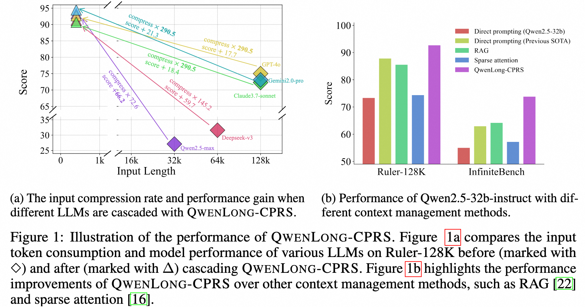
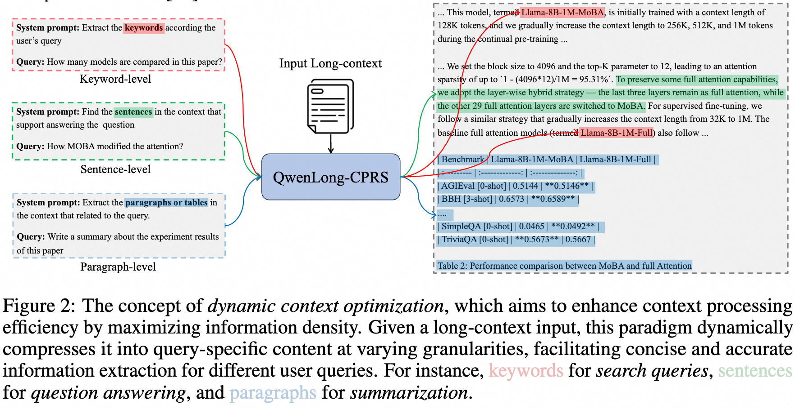
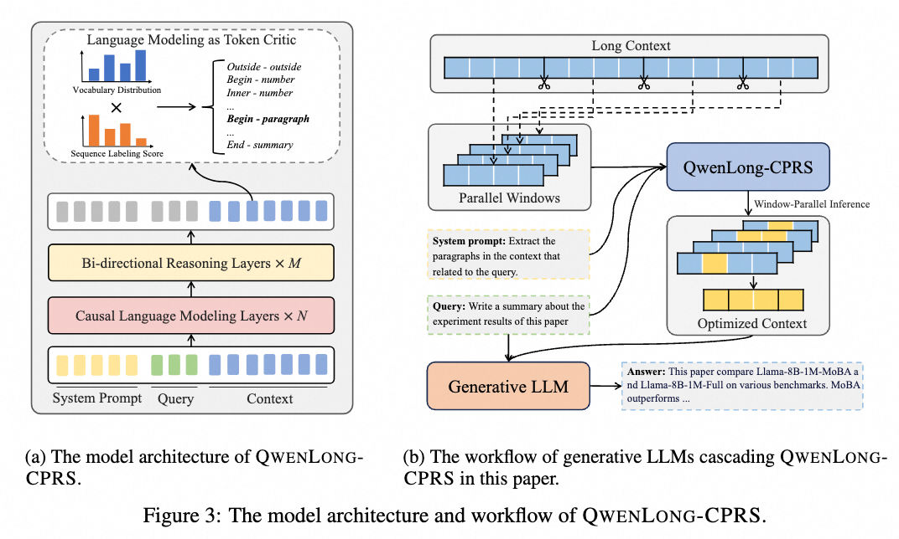
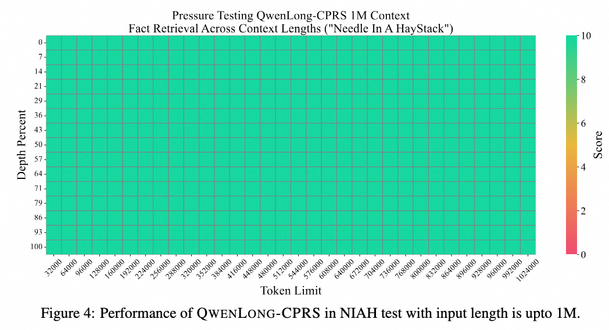
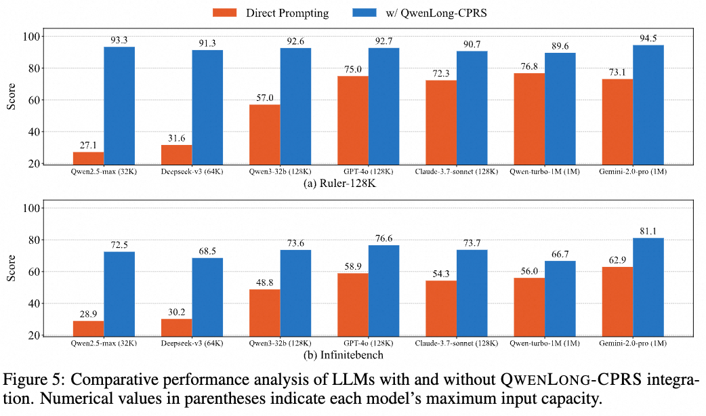
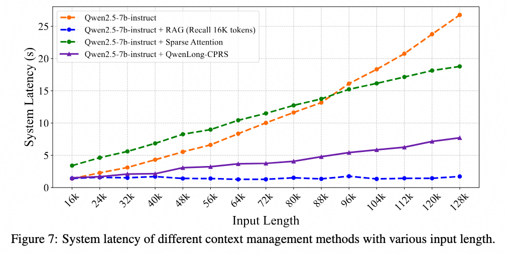
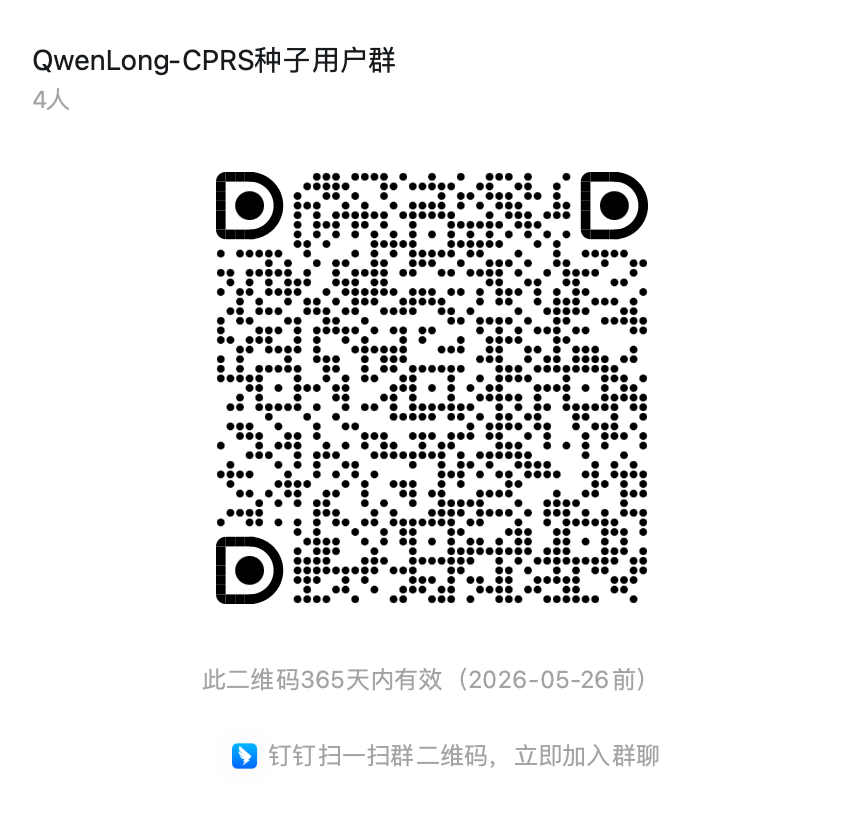

<p align="center" width="100%">
</p>

<div id="top" align="center">

QwenLong-CPRS: Towards ∞-LLMs with Dynamic Context Optimization
-----------------------------
[](https://opensource.org/licenses/Apache-2.0)
[](https://arxiv.org/abs/2505.18092)
[](https://github.com/Tongyi-Zhiwen)
[](https://modelscope.cn/models/iic/QwenLong-CPRS-7B)
[](https://huggingface.co/Tongyi-Zhiwen)

<!-- **Authors:** -->

_**Weizhou Shen, Chenliang Li, Fanqi Wan, Shengyi Liao, Shaopeng Lai, Bo Zhang, Yingcheng Shi, Yuning Wu, Gang Fu, Zhansheng Li, Bin Yang,Ji Zhang, Fei Huang, Jingren Zhou, Ming Yan***_


<!-- **Affiliations:** -->


_Tongyi Lab, Alibaba Group_

<p align="center">
     <br>
</p>


</div>

## 📚 Introduction

In this work, we present QwenLong-CPRS, a novel framework designed to optimize long-context processing through query-aware multi-granularity compression, outperforming RAG and sparse attention methods. Distinct from RAG's coarse chunk-level retrieval, it achieves precise information extraction via token-level content selection, enhancing accuracy. Unlike sparse attention (SA) requiring model retraining, it functions as a plug-and-play module compatible with any downstream LLMs while eliminating retraining demands. This dual advantage enables both fine-grained context optimization and seamless integration across architectures.


<p align="center">
     <br>
</p>

We implement QwenLong-CPRS with four key innovations:
* _**Controllable Context Optimization**_: Processes control prompts + queries to generate compact, task-specific context segments without retraining.

* _**Hybrid Attention Architecture**_: Combines bi-directional modeling (context localization) with causal LM (representation fidelity).

* _**LM-as-Critic Framework**_: Repurposes the pretrained LM head to score token relevance, preserving original knowledge while enabling compression.

* _**Window-Parrallel Inference**_: Splits long context into $w$-sized windows for parallel processing, reducing prefill complexity.


<p align="center">
     <br>
</p>

## 🎉 News

- **May 26, 2025:** 🔥 We release [🤗 QwenLong-CPRS-7B](https://huggingface.co/Tongyi-Zhiwen/QwenLong-CPRS-7B), a  7B context compression model designed for explicit long-context optimization. 
🔥**Key Achievements**: 
✅  **Superior Performance**: Outperforms RAG and sparse attention in both accuracy and efficiency across five long-context benchmarks. 
✅  **Universal Compatibility**: Seamlessly integrates with all flagship LLMs (GPT-4o, Gemini 2.0-pro, Claude 3.7-sonnet, DeepSeek-v3, Qwen2.5-max), achieving 21.59× context compression and +19.15 avg. performance boost. 
✅  **New SOTA**: When paired with Qwen2.5-32B-Instruct, it surpasses top proprietary models by +4.85 on Ruler-128K and +10.88 on InfiniteBench, setting a new SOTA.

- **May 24, 2025:** 🔥 We release the 💻 [Demo Code](https://github.com/Tongyi-Zhiwen/QwenLong-CPRS/examples) for deploying the QwenLong-CPRS API and runing simpling long-context tasks with QwenLong-CPRS cascading an LLM.


## 🎯 Model Results

Here are the evaluation results.

<p align="center">
     <br>
</p>

<p align="center">
     <br>
</p>

<p align="center">
     <br>
</p>


<p align="center">
     <br>
</p>

## 🛠️ Requirements

```bash
# Create the conda environment
conda create -n qwenlong-cprs python==3.10
conda activate qwenlong-cprs

# Install verl
cd QwenLong-CPRS
pip3 install -e .
```

## 🚀 Quick Start

Here we provide how to run QwenLong-CPRS with LLM in a long-context task:

### Step 1: Deploy local QwenLong-CPRS API
```bash
cd QwenLong-CPRS/src/api_utils
export CUDA_VISIBLE_DEVICES=0 
export MODEL_DIR="Tongyi-Zhiwen/QwenLong-CPRS-7B"
uvicorn run_api:app --port 8091 --host '0.0.0.0' --workers 1
```

### Step 2: Data Preparation
Download Ruler-128K test data from [huggingface-hub](https://huggingface.co/datasets/Tongyi-Zhiwen/ruler-128k-subset) and put it on the `data` folder.


### Step 3: Run the demo inference code
```bash
cd QwenLong-CPRS/examples
export LLM_APIKEY="" # your llm api key
export LLM_APIURL="" # your llm api url


# for NIAH tasks
export CPRS_PROMPT="You are an expert for information extraction, your task is to extract the 'needles' in the format of  'One of the special magic {type_needle_v} for {key} is: {value}.' from the documents to answer user's question.\N## tagging rule:\n- tag the needles with 'needle'"
python infer.py \
 --model "your LLM model name" \
 --input_path "data/niah.jsonl" \
 --output_path "output/llm_with_cprs/niah.jsonl" \
 --cprs_prompt $CPRS_PROMPT \
 --use_compress True


# for qa tasks
export CPRS_PROMPT="You are an expert for information extraction, your task is to extract some sentences from the documents as the supporting facts of the user's question.\n## tagging rule:\n- tag the supporting facts with 'fact'"
python infer.py \
 --model "your LLM model name" \
 --input_path "data/qa.jsonl" \
 --output_path "output/llm_with_cprs/niah.jsonl" \
 --cprs_prompt $CPRS_PROMPT \
 --use_compress True


# for variable tracking tasks
export CPRS_PROMPT="You are an expert for information extraction, your task is to extract the assigment chains like 'VAR XXX1 = XXX2' from the documents to answer the question of the user.\n## tagging rule:\n- tag the assignment chains with 'chain'"
python infer.py \
 --model "your LLM model name" \
 --input_path "data/qa.jsonl" \
 --output_path "output/llm_with_cprs/niah.jsonl" \
 --cprs_prompt $CPRS_PROMPT \
 --use_compress True
```


## 🌐 Join the Community
Chinese users can scan QR codes to join DingTalk/WeChat groups.

| WeChat | DingTalk |
|----------|---------|
|  |  |

## 📝 Citation

If you find this work is relevant with your research or applications, please feel free to cite our work!
```
@misc{shen2025qwenlongcprsinftyllmsdynamiccontext,
      title={QwenLong-CPRS: Towards $\infty$-LLMs with Dynamic Context Optimization}, 
      author={Weizhou Shen and Chenliang Li and Fanqi Wan and Shengyi Liao and Shaopeng Lai and Bo Zhang and Yingcheng Shi and Yuning Wu and Gang Fu and Zhansheng Li and Bin Yang and Ji Zhang and Fei Huang and Jingren Zhou and Ming Yan},
      year={2025},
      eprint={2505.18092},
      archivePrefix={arXiv},
      primaryClass={cs.CL},
      url={https://arxiv.org/abs/2505.18092}, 
}
```
